# Jarkom-Modul-2-2026-K-47

| No | Nama | NRP |
|:---:|---|---|
| 1 | Elisabeth La Satta Sitorus | 5027251039 |
| 2 | Farrel Muhammad Athasyah Enrizy | 5027251100 |

### Soal 1 (Elisabeth & Farrel)
Membuat topologi *The Mesh* dengan **rootkit** sebagai *gateway*.  
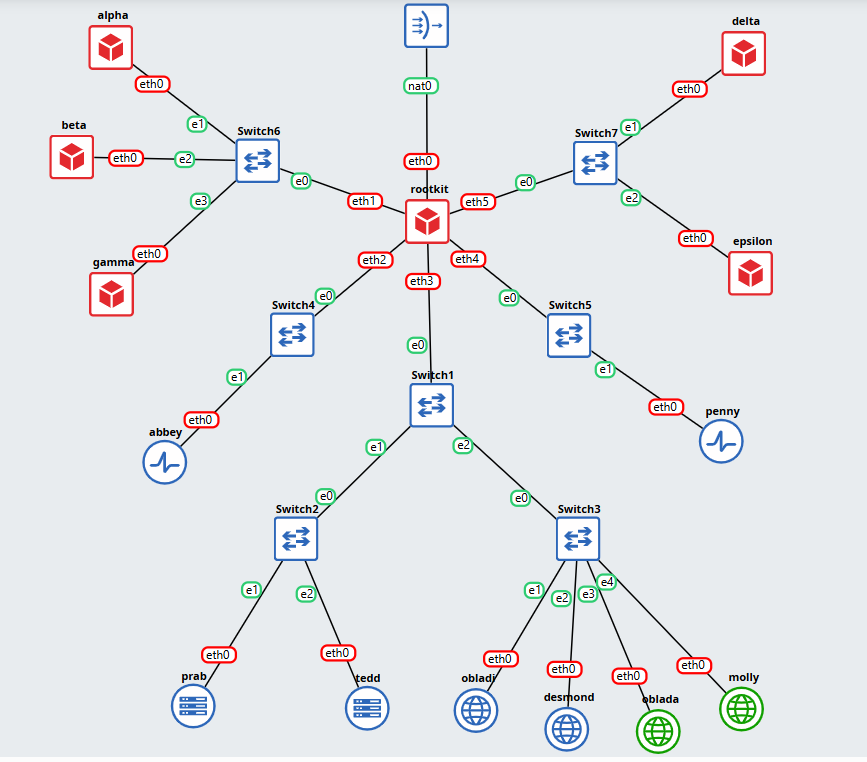

Konfigurasi IP masing-masing entitas:
**rootkit**
```
auto lo
iface lo inet loopback

auto eth0
iface eth0 inet dhcp

# Switch 6 
auto eth1
iface eth1 inet static
    address 10.87.1.1
    netmask 255.255.255.0

# Switch 4 
auto eth2
iface eth2 inet static
    address 10.87.3.1
    netmask 255.255.255.0

# Switch 1 
auto eth3
iface eth3 inet static
    address 10.87.5.1
    netmask 255.255.255.0

# Switch 5
auto eth4
iface eth4 inet static
    address 10.87.4.1
    netmask 255.255.255.0

# Switch 7
auto eth5
iface eth5 inet static
    address 10.87.2.1
    netmask 255.255.255.0
```

**alpha**
```
auto eth0
iface eth0 inet static
    address 10.87.1.2
    netmask 255.255.255.0
    gateway 10.87.1.1
```

**beta**
```
auto eth0
iface eth0 inet static
    address 10.87.1.3
    netmask 255.255.255.0
    gateway 10.87.1.1
```

**gamma**
```
auto eth0
iface eth0 inet static
    address 10.87.1.4
    netmask 255.255.255.0
    gateway 10.87.1.1
```

**delta**
```
auto eth0
iface eth0 inet static
    address 10.87.2.2
    netmask 255.255.255.0
    gateway 10.87.2.1
```

**epsilon**
```
auto eth0
iface eth0 inet static
    address 10.87.2.3
    netmask 255.255.255.0
    gateway 10.87.2.1
```
    
**abbey**
```
auto eth0
iface eth0 inet static
    address 10.87.3.2
    netmask 255.255.255.0
    gateway 10.87.3.1
```
    
**penny**
```
auto eth0
iface eth0 inet static
    address 10.87.4.2
    netmask 255.255.255.0
    gateway 10.87.4.1
```

**prab**
```
auto eth0
iface eth0 inet static
    address 10.87.5.2
    netmask 255.255.255.0
    gateway 10.87.5.1
```
    
**tedd**
```
auto eth0
iface eth0 inet static
    address 10.87.5.3
    netmask 255.255.255.0
    gateway 10.87.5.1
```

**obladi**
```
auto eth0
iface eth0 inet static
    address 10.87.5.4
    netmask 255.255.255.0
    gateway 10.87.5.1
```
    
**desmond**
```
auto eth0
iface eth0 inet static
    address 10.87.5.5
    netmask 255.255.255.0
    gateway 10.87.5.1
```

**oblada**
```
auto eth0
iface eth0 inet static
    address 10.87.5.6
    netmask 255.255.255.0
    gateway 10.87.5.1
```
   
**molly**
```
auto eth0
iface eth0 inet static
    address 10.87.5.7
    netmask 255.255.255.0
    gateway 10.87.5.1
  ```

### Soal 2 (Elisabeth)
Kita diminta untuk membuka jalur **rootkit** ke NAT agar bisa mengakses internet publik dengan mengubah konfigurasinya,  
**rootkit**
```
auto eth0
iface eth0 inet dhcp
    up echo 1 > /proc/sys/net/ipv4/ip_forward
    post-up iptables -t nat -A POSTROUTING -o eth0 -j MASQUERADE
```
Lakukan tes `ping 8.8.8.8` atau `ping google.com` di *console* **rootkit**:  
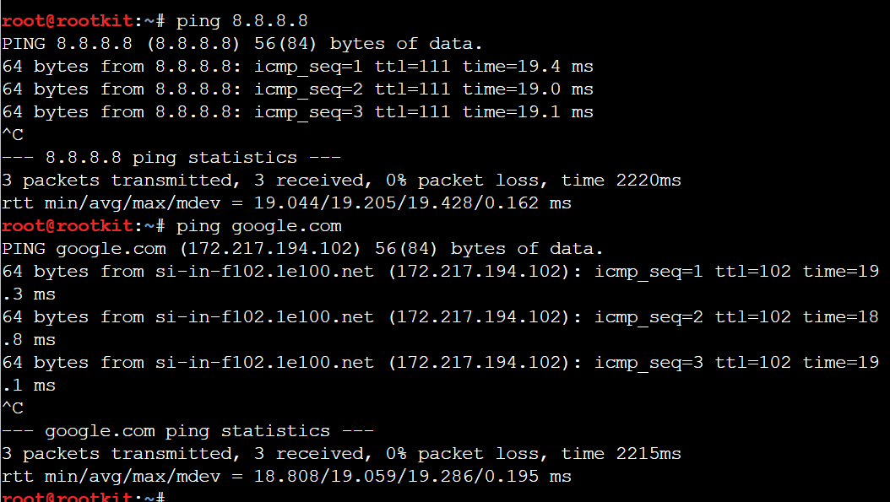

### Soal 3 (Elisabeth)
Kita diminta untuk membuka jalur tiap entitas non-router ke NAT agar bisa mengakses internet publik dan menambahkan resolver ke 192.168.122.1 dengan mengubah konfigurasinya,  
**alpha**
```
auto eth0
iface eth0 inet static
    address 10.87.1.2
    netmask 255.255.255.0
    gateway 10.87.1.1
    up echo "nameserver 192.168.122.1" > /etc/resolv.conf
```

**beta**
```
auto eth0
iface eth0 inet static
    address 10.87.1.3
    netmask 255.255.255.0
    gateway 10.87.1.1
    up echo "nameserver 192.168.122.1" > /etc/resolv.conf
```

**gamma**
```
auto eth0
iface eth0 inet static
    address 10.87.1.4
    netmask 255.255.255.0
    gateway 10.87.1.1
    up echo "nameserver 192.168.122.1" > /etc/resolv.conf
```

**delta**
```
auto eth0
iface eth0 inet static
    address 10.87.2.2
    netmask 255.255.255.0
    gateway 10.87.2.1
    up echo "nameserver 192.168.122.1" > /etc/resolv.conf
```

**epsilon**
```
auto eth0
iface eth0 inet static
    address 10.87.2.3
    netmask 255.255.255.0
    gateway 10.87.2.1
    up echo "nameserver 192.168.122.1" > /etc/resolv.conf
```

**abbey**
```
auto eth0
iface eth0 inet static
    address 10.87.3.2
    netmask 255.255.255.0
    gateway 10.87.3.1
    up echo "nameserver 192.168.122.1" > /etc/resolv.conf
```

**penny**
```
auto eth0
iface eth0 inet static
    address 10.87.4.2
    netmask 255.255.255.0
    gateway 10.87.4.1
    up echo "nameserver 192.168.122.1" > /etc/resolv.conf
```

**prab**
```
auto eth0
iface eth0 inet static
    address 10.87.5.2
    netmask 255.255.255.0
    gateway 10.87.5.1
    up echo "nameserver 192.168.122.1" > /etc/resolv.conf
```

**tedd**
```
auto eth0
iface eth0 inet static
    address 10.87.5.3
    netmask 255.255.255.0
    gateway 10.87.5.1
    up echo "nameserver 192.168.122.1" > /etc/resolv.conf
```

**obladi**
```
auto eth0
iface eth0 inet static
    address 10.87.5.4
    netmask 255.255.255.0
    gateway 10.87.5.1
    up echo "nameserver 192.168.122.1" > /etc/resolv.conf
```

**desmond**
```
auto eth0
iface eth0 inet static
    address 10.87.5.5
    netmask 255.255.255.0
    gateway 10.87.5.1
    up echo "nameserver 192.168.122.1" > /etc/resolv.conf
```

**oblada**
```
auto eth0
iface eth0 inet static
    address 10.87.5.6
    netmask 255.255.255.0
    gateway 10.87.5.1
    up echo "nameserver 192.168.122.1" > /etc/resolv.conf
```
   
**molly**
```
auto eth0
iface eth0 inet static
    address 10.87.5.7
    netmask 255.255.255.0
    gateway 10.87.5.1
    up echo "nameserver 192.168.122.1" > /etc/resolv.conf
```

Lakukan tes `ping 8.8.8.8` atau `ping google.com`:  
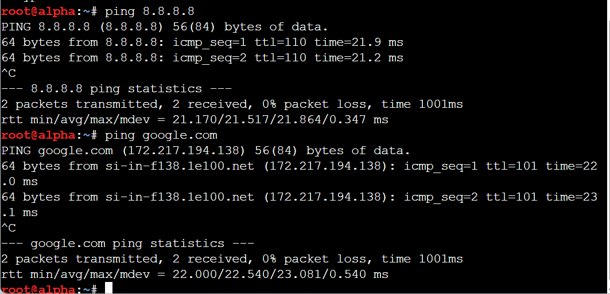  
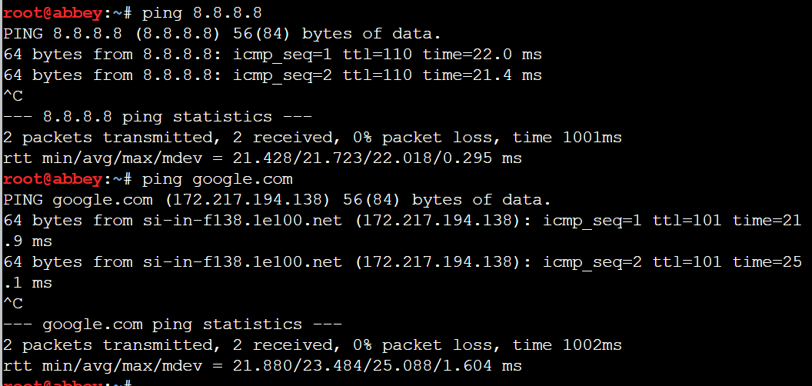  
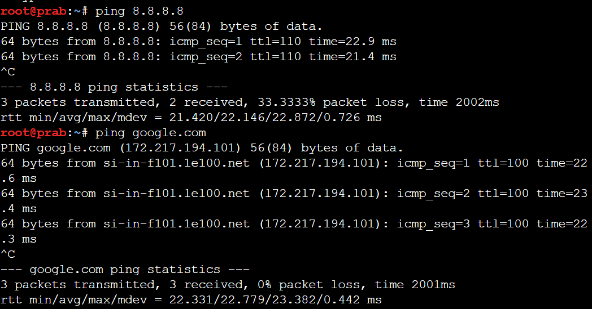

### Soal 4 (Elisabeth)
Pada node **prab**, bangun zona `<xxxx>.com` sebagai *authoritative* dengan SOA yang menunjuk ke `prab.<xxxx>.com`, serta tambahkan catatan NS untuk `prab.<xxxx>.com` dan `tedd.<xxxx>.com`. Buat A record untuk `prab.<xxxx>.com` dan `tedd.<xxxx>.com` yang mengarah ke alamat IP mereka masing-masing, serta A record apex `<xxxx>.com` yang mengarah ke **penny**. Aktifkan fitur *notify* dan *allow-transfer* ke **tedd**, lalu set forwarders ke `192.168.122.1`. Di node **tedd**, tarik zona `<xxxx>.com` dari master dan pastikan server menjawab secara *authoritative*. Perbarui urutan resolver pada seluruh Entitas non-router menjadi: IP prab, IP tedd, lalu 192.168.122.1.

**Node prab & Node tedd**  
Instalasi bind9
```
apt-get update
apt-get install bind9 dnsutils
```
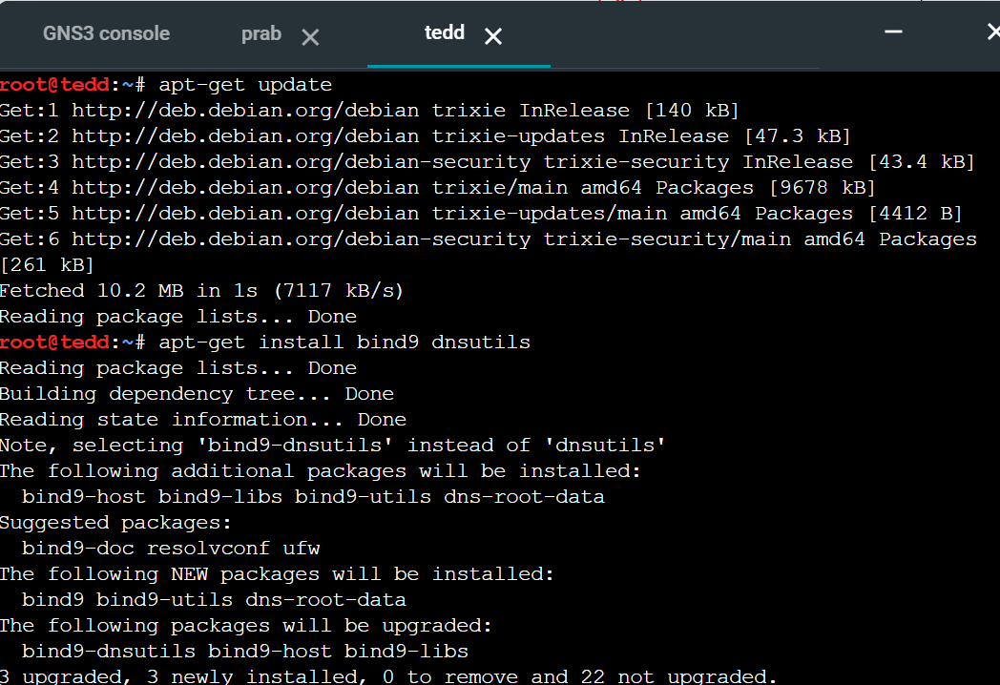

**Node prab**
```
nano /etc/bind/named.conf.options
options {
        directory "/var/cache/bind";

        forwarders {
                192.168.122.1;
        };
};
```

Mendeklarasi zona file local  
```
nano /etc/bind/named.conf.local
zone "k47.com" {
    type master;
    file "/etc/bind/db.k47.com";
    allow-transfer { 10.87.5.3; };
    notify yes;
};
```

Membuat file zona record DNS  
```
nano /etc/bind/db.k47.com
$TTL    604800
@       IN      SOA     prab.k47.com. admin.k47.com. (
                              1         ; Serial
                         604800         ; Refresh
                          86400         ; Retry
                        2419200         ; Expire
                         604800 )       ; Negative Cache TTL
;
@       IN      NS      prab.k47.com.
@       IN      NS      tedd.k47.com.

prab    IN      A       10.87.5.2
tedd    IN      A       10.87.5.3
@       IN      A       10.87.4.2
```

Restart
```
named
```

Cek keberhasilan di node entitas (alpha)
```
ping prab.k47.com
```

**Node tedd**
Mendeklarasi zona slave (tedd)
```
nano /etc/bind/named.conf.local
zone "k47.com" {
    type slave;
    masters { 10.87.5.2; };
    file "/var/cache/bind/db.k47.com";
};
```
Restart
```
named
```

Tes ping di node entitas (alpha)  
```
ping k47.com
ping tedd.k47.com
host k47.com 10.87.5.3
```

Update konfigurasi tiap node entitas selain **prab** dan **tedd**,  
```
up echo -e "nameserver 10.87.5.2\nnameserver 10.87.5.3\nnameserver 192.168.122.1" > /etc/resolv.conf
```

**Node prab & tedd**
```
named
```

Tes ping kembali di tiap node tiap area,  
```
ping k47.com
ping tedd.k47.com
host k47.com 10.87.5.3
```

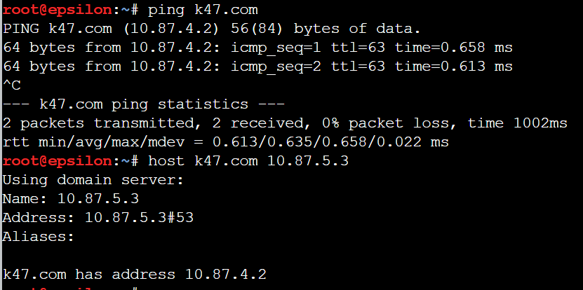  
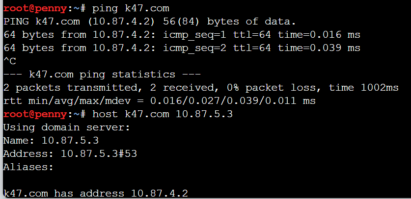  
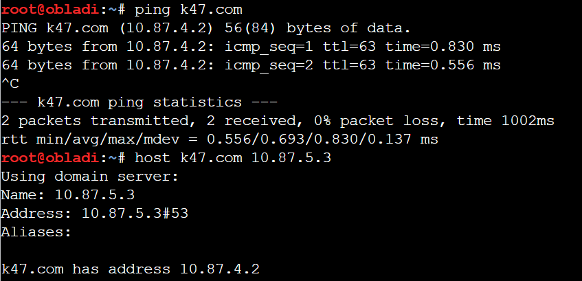  
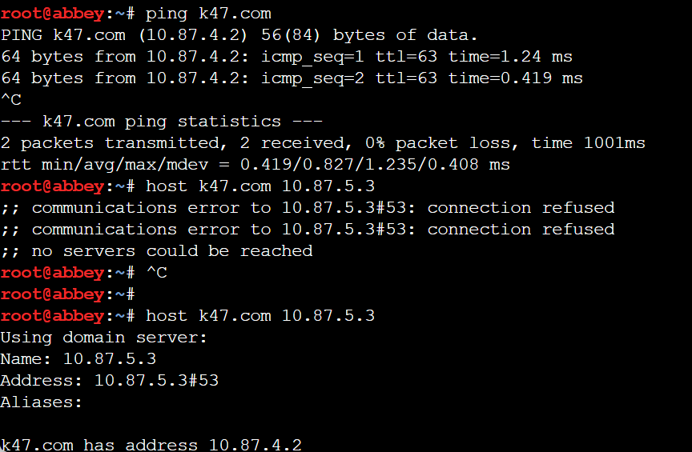

### Soal 5 (Elisabeth)
Namai semua Entitas sesuai **rootkit, alpha, beta, gamma, delta, epsilon, prab, tedd, abbey, penny, obladi, desmond, oblada, molly**, dan verifikasi bahwa setiap host mengenali hostname tersebut. Buat setiap domain untuk masing-masing node sesuai dengan namanya `alpha.<xxxx>.com` dan assign IP masing-masing juga. Lakukan pengecualian untuk node yang bertanggung jawab atas prab dan tedd.  

**Node prab**
```
nano /etc/bind/db.k47.com
# tambahkan
rootkit  IN      A       10.87.1.1   
alpha    IN      A       10.87.1.2
beta     IN      A       10.87.1.3
gamma    IN      A       10.87.1.4
delta    IN      A       10.87.2.2
epsilon  IN      A       10.87.2.3
abbey    IN      A       10.87.3.2
penny    IN      A       10.87.4.2
obladi   IN      A       10.87.5.4
desmond  IN      A       10.87.5.5
oblada   IN      A       10.87.5.6
molly    IN      A       10.87.5.7
```

Lalu ganti *serial number* menjadi 4.  
Restart
```
named
```

**Node tedd**
```
pkill named
named
```

Tes tiap domain di host mana saja (alpha)
```
ping alpha.k47.com
ping beta.k47.com
ping molly.k47.com
```

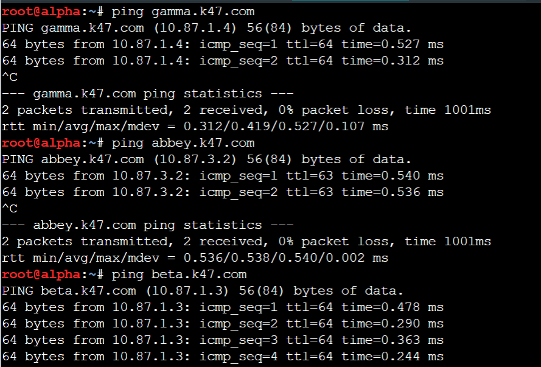  
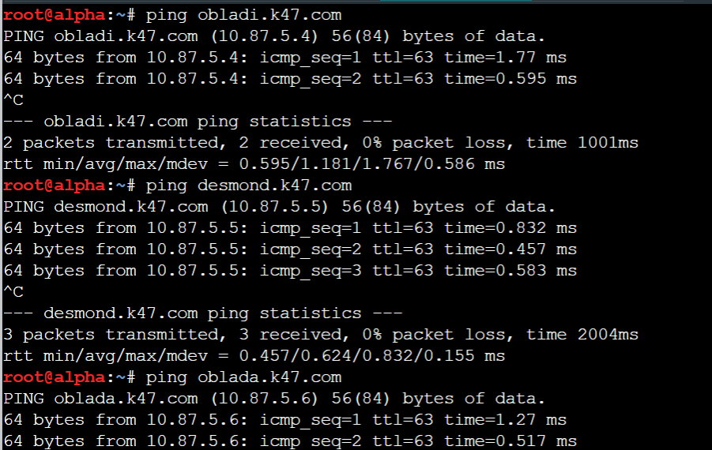  
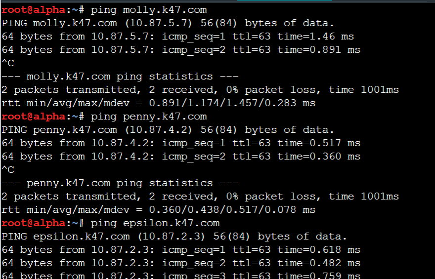  
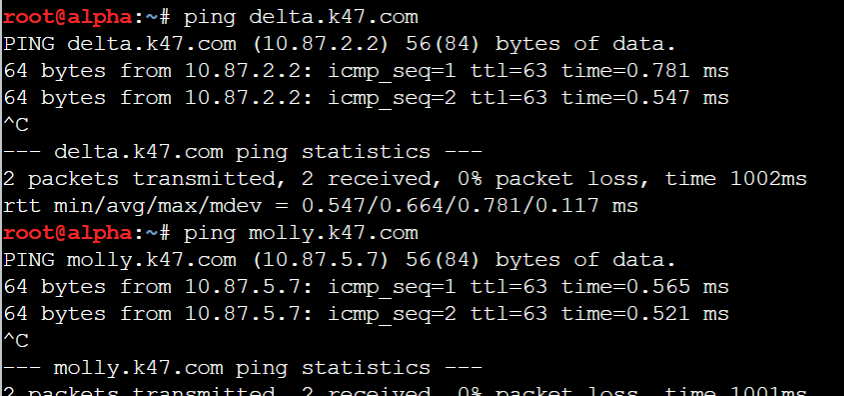  

### Soal 6 (Elisabeth)
Pastikan zone transfer berjalan, pastikan **tedd** telah menerima salinan zona terbaru dari **prab**. Nilai serial SOA di keduanya harus sama.  
**Node prab & tedd**
```
dig @10.87.5.2 k47.com SOA +short
dig @10.87.5.3 k47.com SOA +short
```

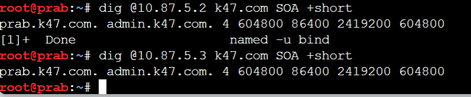  

### Soal 7 (Elisabeth)
**abbey** dan **penny** sebagai gerbang utama, **obladi** dan **desmond** sebagai web statis, **oblada** dan **molly** sebagai web dinamis. Tambahkan pada zona `<xxxx>.com` A record untuk `vault.<xxxx>.com` (IP obladi & desmond), dan `core.<xxxx>.com` (IP oblada & molly). Tetapkan CNAME:  
- www.<xxxx>.com → penny.<xxxx>.com
- static.<xxxx>.com → abbey.<xxxx>.com
Verifikasi dari dua klien berbeda bahwa seluruh hostname tersebut ter-resolve ke tujuan yang benar dan konsisten.
**Node prab & tedd**
```
nano /etc/bind/db.k47.com
 #add
 ; A Record Multipel (Round Robin)
vault   IN      A       10.87.5.4
vault   IN      A       10.87.5.5
core    IN      A       10.87.5.6
core    IN      A       10.87.5.7

; CNAME (Alias)
www     IN      CNAME   penny
static  IN      CNAME   abbey
```

Restart
```
named
```

Tes ping di 2 node client berbeda:  
```
ping vault.k47.com
ping core.k47.com
ping www.k47.com
ping static.k47.com
```

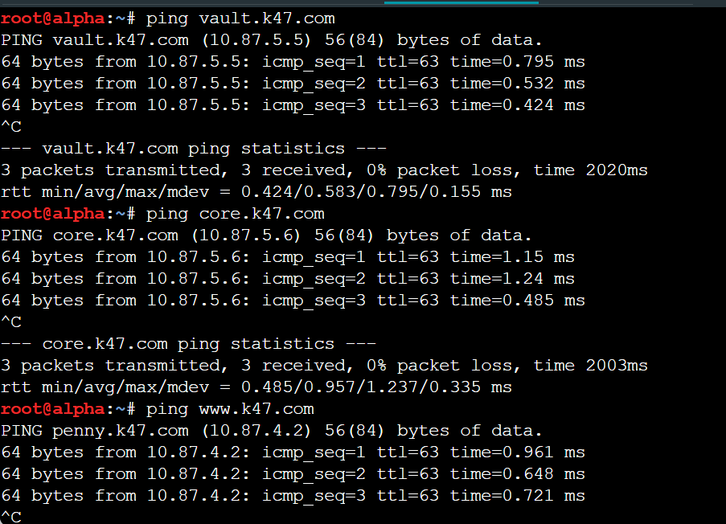
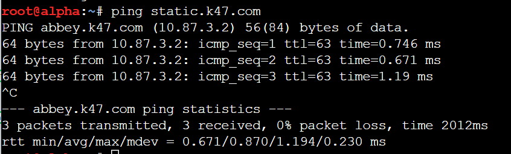
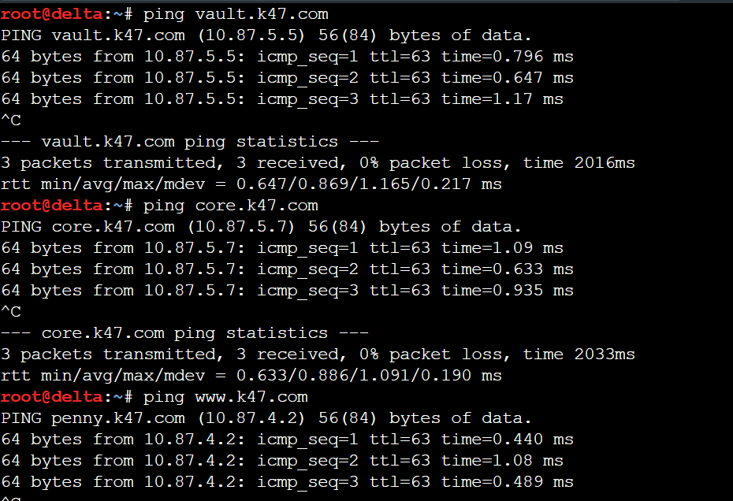
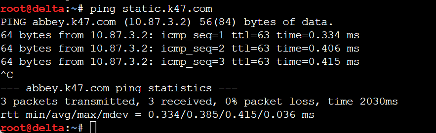  

### Soal 8 (Elisabeth)
Di **prab** deklarasikan reverse zone untuk segmen jaringan  tempat **abbey, penny, area vault, dan area core** berada. Di **tedd** tarik reverse zone tersebut sebagai slave, isi PTR untuk keempat hostname itu agar pencarian balik IP address mengembalikan hostname yang benar, lalu pastikan query reverse untuk alamat **abbey, penny, area vault, dan area core** dijawab *authoritative*.  
**Node prab**
```
nano /etc/bind/named.conf.local
# add
zone "87.10.in-addr.arpa" {
    type master;
    file "/etc/bind/rev.87.10";
    allow-transfer { 10.87.5.3; };
};

nano /etc/bind/rev.87.10
$TTL    604800
@       IN      SOA     prab.k47.com. admin.k47.com. (
                              1         ; Serial
                         604800         ; Refresh
                          86400         ; Retry
                        2419200         ; Expire
                         604800 )       ; Negative Cache TTL
@       IN      NS      prab.k47.com.
@       IN      NS      tedd.k47.com.

; Format: oktet_ke4.oktet_ke3 IN PTR hostname.
2.3     IN      PTR     abbey.k47.com.
2.4     IN      PTR     penny.k47.com.
4.5     IN      PTR     vault.k47.com.
5.5     IN      PTR     vault.k47.com.
6.5     IN      PTR     core.k47.com.
7.5     IN      PTR     core.k47.com.
```

**Node tedd**
```
nano /etc/bind/named.conf.local
# add
zone "87.10.in-addr.arpa" {
    type slave;
    masters { 10.87.5.2; };
    file "/var/lib/bind/rev.87.10";
};
```

**Node prab & tedd**
```
pkill named
named -u bind &
```

Tes di node client **(alpha & delta)**:  
```
dig @10.87.5.2 -x 10.87.3.2
dig @10.87.5.2 -x 10.87.5.4
```
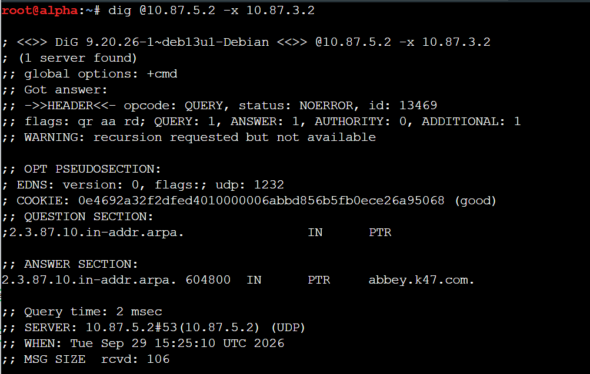  
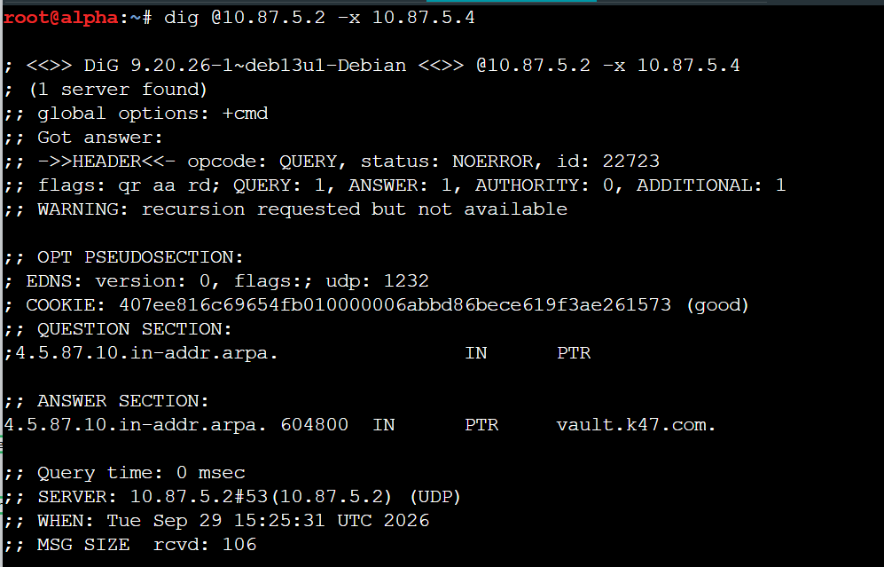  
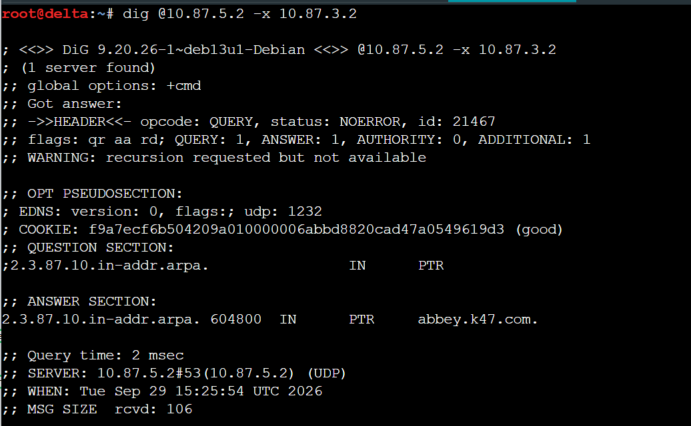  
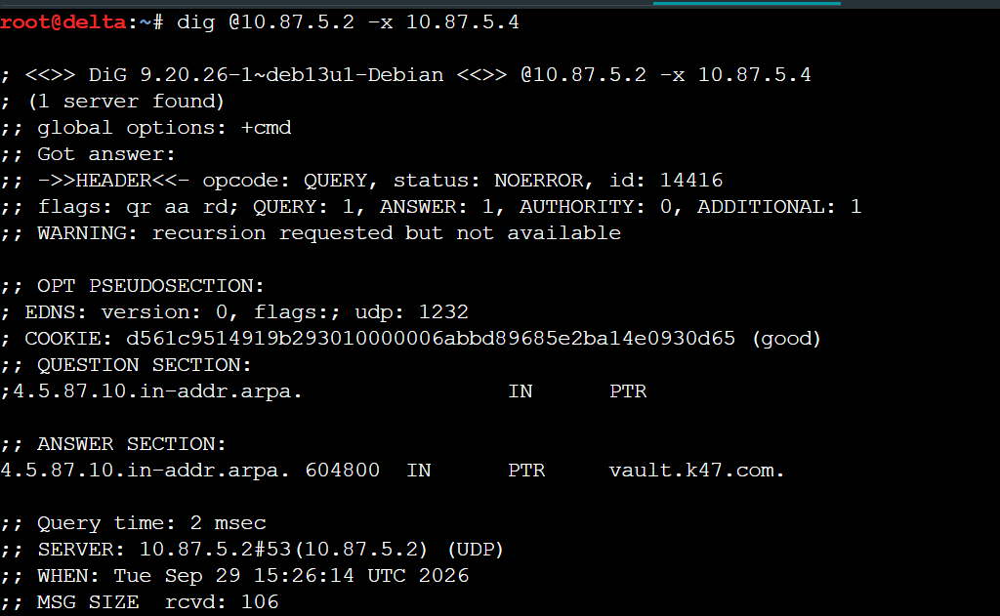  

### Soal 9 (Elisabeth)
Jalankan layanan web statis pada hostname di node **area vault** (menggunakan *apache*). Buka folder direktori /arsip/ dan aktifkan fitur autoindex pada konfigurasi Apache sehingga seluruh daftar file di dalamnya dapat ditelusuri langsung dari browser. Akses pengujian harus dilakukan melalui hostname, bukan IP address.  
**Node obladi & desmond**
```
apt-get update
apt-get install apache2 -y

mkdir -p /var/www/html/arsip
touch /var/www/html/arsip/dokumen_penting.pdf
touch /var/www/html/arsip/catatan.txt

ls -la /var/www/html/arsip/ # cek apakah ada index.html, kalau tidak ada bisa lanjut
```
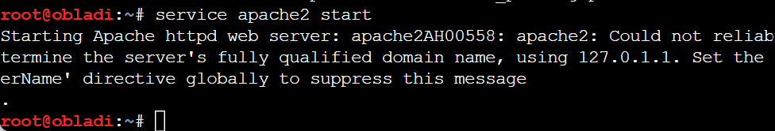

Jalankan web server:  
```
service apache2 start
```

Tes di node client (alpha & node lainnya)  
```
curl http://vault.k47.com/arsip/
```
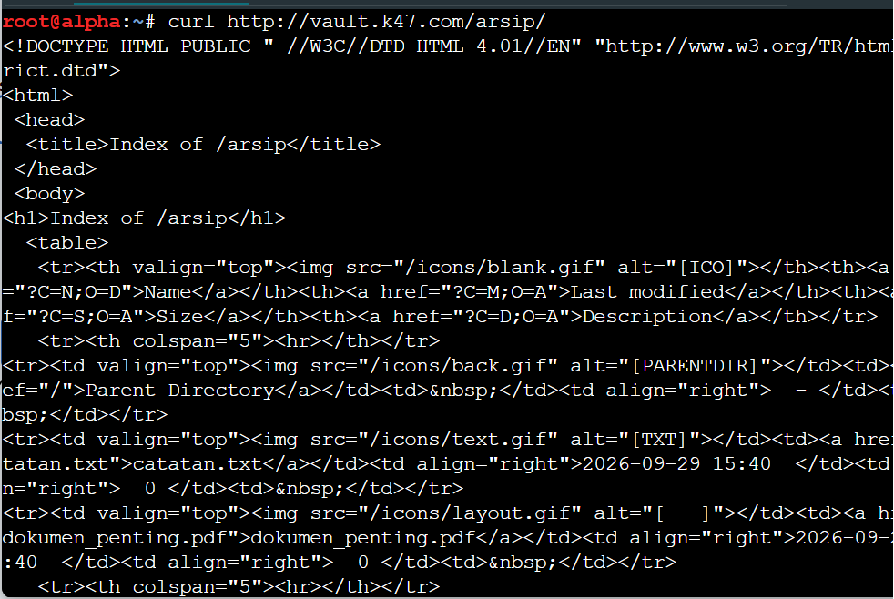  
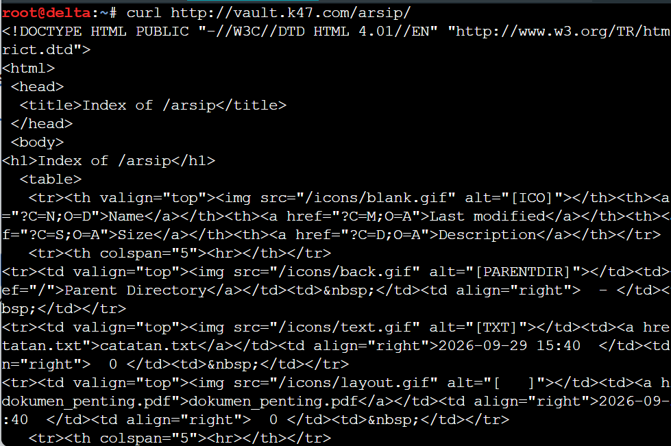  

Cek load balancing sudah jalan atau belum:  
```
for i in {1..6}; do dig +short vault.k47.com; sleep 1; done
```
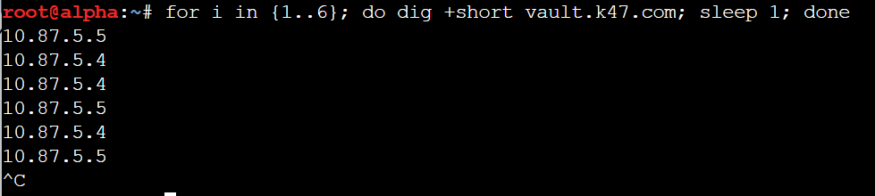

### Soal 10 (Elisabeth)
Jalankan layanan web dinamis (PHP-FPM) pada hostname di node **core** (menggunakan nginx). Buat sebuah aplikasi sederhana yang memuat halaman beranda dan halaman profil. Terapkan aturan rewrite pada server sehingga akses ke /profil dapat berfungsi dengan URL bersih (tanpa akhiran .php). Akses pengujian wajib dilakukan melalui hostname.  
**Node molly & oblada**
```
apt-get update
apt-get install nginx php-fpm -y

mkdir -p /var/www/html
nano /var/www/html/index.php
<h1>Selamat Datang di Berada K-47</h1>
<p>Ini adalah halaman utama website K-47</p>

nano /var/www/html/profil.php
<h1>Halaman Profil Pengguna</h1>
<p>Ini adalah halaman profil K-47.</p>

# Konfigurasi Nginx dan Aturan Rewrite URL 
nano /etc/nginx/sites-available/default
server {
    listen 80 default_server;
    listen [::]:80 default_server;

    root /var/www/html;
    index index.php index.html index.htm;

    server_name core.k47.com localhost;

    location / {
        # Aturan rewrite agar /profil otomatis mengarah ke /profil.php tanpa menampilkan ekstensi
        try_files $uri $uri/ $uri.php?$args;
    }

    # Konfigurasi agar Nginx bisa mengeksekusi PHP melalui PHP-FPM
    location ~ \.php$ {
    include snippets/fastcgi-php.conf;
    fastcgi_pass unix:/run/php/php8.4-fpm.sock;
    }
}
```

```
# restart nginx
service php8.4-fpm start
ls -l /run/php/ # opsional ngetest socket php-fpm
service nginx restart

# cek nginx sudah benar atau belum
nginx -t
```
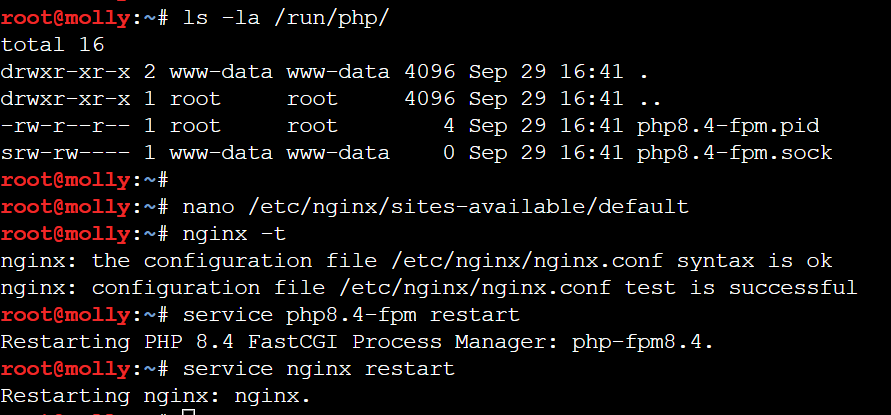

Panggil browser dengan `curl` di node lain:  
```
curl http://core.k47.com/
curl http://core.k47.com/profil
```

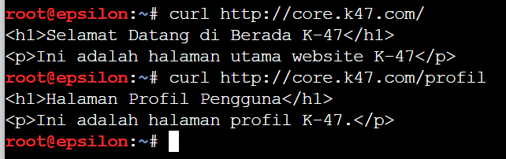  
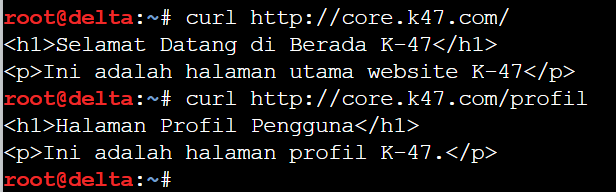

### Soal 11 (Reverse Proxy & Load Balancing)
Lakukan konfigurasi Reverse Proxy dan Load Balancing pada node Penny (menggunakan Apache) untuk klaster Vault dan node Abbey (menggunakan Nginx) untuk klaster Core, yang mengarah pada node backend masing-masing.
Konfigurasi Proxy Penny:
```
apt update
apt install apache2 -y
a2enmod proxy proxy_http proxy_balancer lbmethod_byrequests headers
nano /etc/apache2/sites-available/000-default.conf
```
Isi file /etc/apache2/sites-available/000-default.conf di Penny:
```
<VirtualHost *:80>
    <Proxy "balancer://vault_cluster">
        BalancerMember http://10.87.5.4
        BalancerMember http://10.87.5.5
    </Proxy>

    ProxyPreserveHost On
    RequestHeader set X-Real-IP %{REMOTE_ADDR}s

    ProxyPass / balancer://vault_cluster/
    ProxyPassReverse / balancer://vault_cluster/
</VirtualHost>
```
```
service apache2 restart
```

Konfigurasi Proxy Abbey:
```
apt update
apt install nginx -y
nano /etc/nginx/sites-available/default
```
Isi file /etc/nginx/sites-available/default di Abbey:
```
upstream core_cluster {
    server 10.87.5.6;
    server 10.87.5.7;
}

server {
    listen 80;

    location / {
        proxy_pass http://core_cluster;
        
        proxy_set_header Host $host;
        proxy_set_header X-Real-IP $remote_addr;
    }
}
```
```
nginx -t
service nginx restart
```
Konfigurasi Node Backend (Obladi, Desmond, Oblada, Molly):
```
apt update && apt install apache2 -y
echo "Ini server [NAMA_SERVER]" > /var/www/html/index.html
service apache2 start
```
Pengujian dengan curl di node Client (Rootkit):
```
curl http://10.87.4.2
curl http://10.87.3.2
```


### Soal 12 (Basic Authentication)
Tambahkan sistem otentikasi dasar (Basic Authentication) pada path /admin di node Penny menggunakan kredensial tertentu agar tidak bisa diakses sembarang pengguna.

Konfigurasi Node Penny:
```
apt update && apt install apache2-utils -y
htpasswd -b -c /etc/apache2/.htpasswd prabs 'pakar_pinter_jadi_gob***'
mkdir -p /var/www/html/admin
echo "Ini dokumen rahasia sindikat di Penny" > /var/www/html/admin/index.html
nano /etc/apache2/sites-available/000-default.conf
```
Isi file /etc/apache2/sites-available/000-default.conf di Penny:
```
<VirtualHost *:80>
    <Location "/admin">
        AuthType Basic
        AuthName "Ruang Rahasia Sindikat"
        AuthUserFile /etc/apache2/.htpasswd
        Require valid-user
    </Location>

    ProxyPass /admin !

    <Proxy "balancer://vault_cluster">
        BalancerMember http://10.87.5.4
        BalancerMember http://10.87.5.5
    </Proxy>

    ProxyPreserveHost On
    RequestHeader set X-Real-IP %{REMOTE_ADDR}s

    ProxyPass / balancer://vault_cluster/
    ProxyPassReverse / balancer://vault_cluster/
</VirtualHost>
```
```
service apache2 restart
```
Pengujian dari Node Client (Rootkit):
```
# Pengujian tanpa kredensial (akan ditolak / 401 Unauthorized)
curl http://10.87.4.2/admin/

# Pengujian dengan kredensial
curl -u prabs:'pakar_pinter_jadi_gob***' http://10.87.4.2/admin/
```


### Soal 13 (Redirect 301 & 302)
Buat pengaturan pengalihan URL permanen (301) di node Penny dan pengalihan sementara (302) di node Abbey menuju domain target masing-masing.

Konfigurasi Penny:
```
a2enmod rewrite
nano /etc/apache2/sites-available/000-default.conf
```
Isi file /etc/apache2/sites-available/000-default.conf di Penny:
```
<VirtualHost *:80>
    ServerName www.xxx.com
    ServerAlias penny.xxx.com

    RewriteEngine On
    RewriteCond %{HTTP_HOST} ^10\.87\.4\.2$ [OR]
    RewriteCond %{HTTP_HOST} ^penny\.xxx\.com$
    RewriteRule ^(.*)$ http://www.xxx.com$1 [R=301,L]

    <Location "/admin">
        AuthType Basic
        AuthName "Ruang Rahasia Sindikat"
        AuthUserFile /etc/apache2/.htpasswd
        Require valid-user
    </Location>
    ProxyPass /admin !

    <Proxy "balancer://vault_cluster">
        BalancerMember http://10.87.5.4
        BalancerMember http://10.87.5.5
    </Proxy>

    ProxyPreserveHost On
    RequestHeader set X-Real-IP %{REMOTE_ADDR}s

    ProxyPass / balancer://vault_cluster/
    ProxyPassReverse / balancer://vault_cluster/
</VirtualHost>
```
```
service apache2 restart
```
Konfigurasi Node Abbey (Redirect 302):
```
nano /etc/nginx/sites-available/default
```
Isi file /etc/nginx/sites-available/default di Abbey:
```
upstream core_cluster {
    server 10.87.5.6;
    server 10.87.5.7;
}

server {
    listen 80;
    server_name 10.87.3.2 abbey.xxx.com;
    
    return 302 http://static.xxx.com$request_uri;
}

server {
    listen 80;
    server_name static.xxx.com;

    location / {
        proxy_pass http://core_cluster;
        
        proxy_set_header Host $host;
        proxy_set_header X-Real-IP $remote_addr;
    }
}
```
```
nginx -t
service nginx restart
```


### Soal 14 (Log IP Asli Klien)
Mengonfigurasi log format pada web server backend untuk menampilkan IP asli klien yang diteruskan melalui Reverse Proxy.

Konfigurasi Backend Area Vault (Obladi & Desmond):
```
nano /etc/apache2/sites-available/000-default.conf
```
Isi file /etc/apache2/sites-available/000-default.conf di Obladi & Desmond:
```
<VirtualHost *:80>
    DocumentRoot /var/www/html

    LogFormat "%{X-Real-IP}i %l %u %t \"%r\" %>s %b" proxy_combined
    CustomLog ${APACHE_LOG_DIR}/access.log proxy_combined
</VirtualHost>
```
```
apache2ctl configtest
service apache2 restart
```
Konfigurasi Backend Area Core (Oblada & Molly):
```
service apache2 stop
update-rc.d apache2 disable
apt update && apt install nginx -y
nano /etc/nginx/nginx.conf
```
Isi file /etc/nginx/nginx.conf di Oblada & Molly:
(Sisipkan blok ini di dalam blok http { ... })
```
log_format custom_ip '$http_x_real_ip - $remote_user [$time_local] "$request" '
                         '$status $body_bytes_sent "$http_referer" '
                         '"$http_user_agent"';

    access_log /var/log/nginx/access.log custom_ip;
```
```
nginx -t
service nginx start
```
Hasil:


### Soal 15 (Reverse Proxy Path /eternal & /orion)
Mengarahkan direktori spesifik pada proxy menuju backend khusus dengan Nginx dan Apache.   

1. Backend Area Vault & Proxy Penny (/eternal):
```
# Node Obladi & Desmond (Backend /eternal)
apt update && apt install php libapache2-mod-php -y
mkdir -p /var/www/eternal
echo "<?php phpinfo(); ?>" > /var/www/eternal/index.php
nano /etc/apache2/sites-available/000-default.conf
```
Isi blok Alias di 000-default.conf (Obladi & Desmond):
```
Alias /eternal /var/www/eternal
<Directory /var/www/eternal>
    Require all granted
</Directory>
```
```
service apache2 restart

# Node Penny (Proxy)
nano /etc/apache2/sites-available/000-default.conf
```
Isi konfigurasi Proxy di Penny (Letakkan di atas root /):
```
ProxyPass /eternal balancer://vault_cluster/eternal
ProxyPassReverse /eternal balancer://vault_cluster/eternal
```
```
service apache2 restart
```

2. Backend Area Core & Proxy Abbey (/orion):
```
# Node Oblada & Molly (Backend /orion)
mkdir -p /var/www/orion
echo "<h1>Ini adalah halaman statis Orion</h1>" > /var/www/orion/index.html
nano /etc/nginx/sites-available/default
```
Isi lokasi di file default (Oblada & Molly):
```
location /orion {
    alias /var/www/orion;
    index index.html;
}
```
```
service nginx restart

# Node Abbey (Proxy)
nano /etc/nginx/sites-available/default
```
Isi lokasi proxy di default domain static.xxx.com (Abbey):
```
location /orion {
    proxy_pass http://core_cluster/orion;
}
```
```
service nginx restart
```
Hasil:


### Soal 16 (Stress Test ApacheBench)
Melakukan pengujian beban dengan ApacheBench ke titik akhir [www.xxx.com](https://www.xxx.com) dan static.xxx.com.

Eksekusi di Node Client (Alpha / Rootkit):
```
apt update && apt install apache2-utils -y

# Stress Test 1
ab -n 250 -c 10 http://www.xxx.com/

# Stress Test 2
ab -n 250 -c 10 http://static.xxx.com/
```


### Soal 17 (TXT Record DNS BIND9)
Menambahkan record TXT pada server DNS Master untuk memverifikasi entitas klien.

1. Konfigurasi Node Prab (DNS Master):
```
apt update && apt install bind9 -y
nano /etc/bind/named.conf.local
```
Isi file /etc/bind/named.conf.local di Prab:
```
zone "xxx.com" {
    type master;
    file "/etc/bind/db.xxx.com";
};
```
```
nano /etc/bind/db.xxx.com
```
Isi file /etc/bind/db.xxx.com di Prab:
```
$TTL    604800
@       IN  SOA ns.xxx.com. root.xxx.com. (
                        2         ; Serial
                   604800         ; Refresh
                    86400         ; Retry
                   2419200         ; Expire
                   604800 )       ; Negative Cache TTL

@       IN  NS  ns.xxx.com.
ns      IN  A   10.87.5.2

alpha   IN  TXT "alpha"
beta    IN  TXT "beta"
gamma   IN  TXT "gamma"
delta   IN  TXT "delta"
epsilon IN  TXT "epsilon"
```
```
rndc reload
```
2. Pengujian Klien:
```
dig TXT alpha.xxx.com +short
```


### Soal 18 (DNS Master-Slave & TTL)
Mengonfigurasi skema Master-Slave dan mengubah parameter TTL DNS menjadi 15 detik untuk simulasi pembaruan cache A record.

1. Konfigurasi Prab (Master) & Tedd (Slave):
```
# Node Prab (Master)
nano /etc/bind/db.xxx.com
```
Isi file /etc/bind/db.xxx.com di Prab:
```
$TTL    15
@       IN  SOA ns.xxx.com. root.xxx.com. (
                    2026100105  ; Serial (dinaikkan secara berkala)
                15          ; Refresh
                5           ; Retry
                604800      ; Expire
                15 )        ; Negative Cache TTL

@       IN  NS  ns.xxx.com.
ns      IN  A   10.87.5.2

abbey   IN  A   192.168.99.99

alpha   IN  TXT "alpha"
beta    IN  TXT "beta"
gamma   IN  TXT "gamma"
delta   IN  TXT "delta"
epsilon IN  TXT "epsilon"
```
```
rndc reload

# Node Tedd (Slave)
apt update && apt install bind9 -y
nano /etc/bind/named.conf.local
```
Isi file /etc/bind/named.conf.local di Tedd:
```
zone "xxx.com" {
    type slave;
    masters { 10.87.5.2; };
    file "/var/cache/bind/db.xxx.com";
};
```
```
service named restart
rndc reload
```

2. Pengujian di Client (Alpha):
```
getent hosts abbey.xxx.com
# Lakukan query berulang-ulang hingga melampaui 15 detik dan cache terganti
```


### Soal 19 (CNAME & Forwarder BIND9)
Mengaktifkan mode rekursif pada DNS agar klien dapat melakukan lookup ke domain publik dan membuat CNAME untuk domain eksternal[cite: 36].

1. Konfigurasi Node Prab (DNS Master):
```
nano /etc/bind/named.conf.options
```
Isi file /etc/bind/named.conf.options di Prab[cite: 36]:
```
options {
    directory "/var/cache/bind";

    recursion yes;
    allow-query { any; };
    allow-recursion { any; };

    forwarders {
        8.8.8.8;
        1.1.1.1;
    };

    dnssec-validation auto;
    listen-on { any; };
};
```
```
nano /etc/bind/db.xxx.com
```
Isi tambahan record di /etc/bind/db.xxx.com di Prab[cite: 36]:
```
outbound IN CNAME http.badssl.com.
```
```
service named restart

# Di Node Tedd (Slave)
rndc reload
```

2. Pengujian di Client:
```
dig outbound.xxx.com @10.87.5.2
curl -L http://outbound.xxx.com
```


### Soal 20 (Autostart Service & Normalisasi Zona)
Mengembalikan parameter file zona ke semula (Normalisasi dari Soal 18) dan memastikan seluruh daemon web serta DNS menggunakan mode autostart[cite: 37].

1. Normalisasi Zona Prab (DNS Master):
```
nano /etc/bind/db.xxx.com
```
Isi file /etc/bind/db.xxx.com hasil normalisasi di Prab[cite: 37]:
```
$TTL    86400
@       IN  SOA ns.xxx.com. root.xxx.com. (
                    2026100120  ; Serial (naikkan angkanya)
                3600        ; Refresh
                1800        ; Retry
                604800      ; Expire
                86400 )     ; Negative Cache TTL

@       IN  NS  ns.xxx.com.
ns      IN  A   10.87.5.2

abbey   IN  A   10.87.3.2   ; Dikembalikan ke IP asal

outbound IN CNAME http.badssl.com.

alpha   IN  TXT "alpha"
beta    IN  TXT "beta"
gamma   IN  TXT "gamma"
delta   IN  TXT "delta"
epsilon IN  TXT "epsilon"
```
2. Konfigurasi Autostart (Pada Seluruh Node):
```
# Node Prab
update-rc.d named defaults
service named start

# Node Tedd
rndc reload
update-rc.d named defaults
service named start

# Node Penny
update-rc.d apache2 defaults
service apache2 start

# Node Abbey
update-rc.d nginx defaults
service nginx start
```


